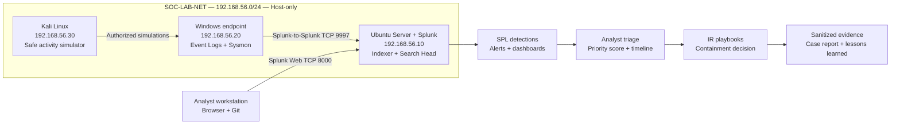
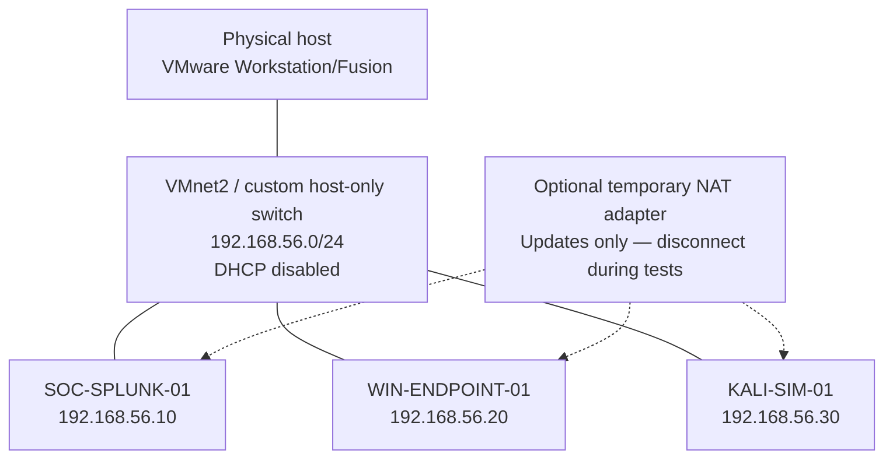
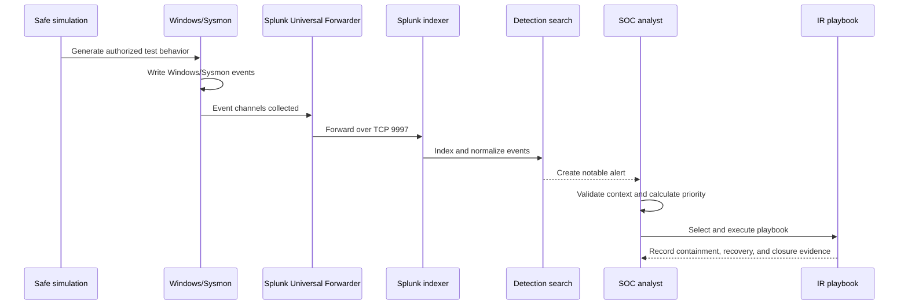
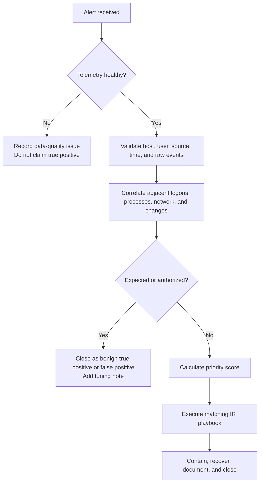

# SOC Monitoring & Incident Response Lab

[](#project-status)
[](#responsible-use)
[](#tools-and-technologies)
[](#telemetry-sources)
[](#detection-catalog)

An end-to-end, reproducible Security Operations Center lab for collecting Windows telemetry, engineering detections, triaging alerts, executing incident-response playbooks, and publishing sanitized investigation evidence.

This repository is designed to answer five practical questions:

1. Can a Windows endpoint reliably send useful security telemetry to a SIEM?
2. Can repeatable, harmless lab behavior trigger explainable detections?
3. Can an analyst distinguish a true positive from normal administrative activity?
4. Can the investigation be documented from alert through closure?
5. Can another learner clone this repository and reproduce the same result?

> [!IMPORTANT]
> This README documents the target lab, configuration, validation criteria, and evidence standard. The project is **not marked complete** until the screenshots, exported searches, detection tests, playbook results, and final case report are added. Empty evidence slots are intentional and are labeled below.

## Table of contents

- [Project status](#project-status)
- [Objectives and completion criteria](#objectives-and-completion-criteria)
- [Scope and non-goals](#scope-and-non-goals)
- [Architecture](#architecture)
- [Lab configuration](#lab-configuration)
- [Tools and technologies](#tools-and-technologies)
- [Repository layout](#repository-layout)
- [Clone and reproduce](#clone-and-reproduce)
- [Step-by-step learning guide and notes](#step-by-step-learning-guide-and-notes)
- [Implementation runbook](#implementation-runbook)
- [Splunk and endpoint configuration](#splunk-and-endpoint-configuration)
- [Telemetry sources](#telemetry-sources)
- [Detection catalog](#detection-catalog)
- [Alert triage and scoring](#alert-triage-and-scoring)
- [Incident-response playbooks](#incident-response-playbooks)
- [Validation plan](#validation-plan)
- [Evidence plan and image placeholders](#evidence-plan-and-image-placeholders)
- [Troubleshooting](#troubleshooting)
- [Expected outcomes](#expected-outcomes)
- [Responsible use](#responsible-use)
- [Official references](#official-references)

## Project status

| Workstream | State | Completion evidence required |
|---|---|---|
| Architecture and build guide | Documented | Peer review of this README |
| Step-by-step learning modules and notes | Documented | Clean-clone and link validation |
| VMware network and VMs | Build pending | VM inventory and network screenshots |
| Splunk receiver | Build pending | Receiving-port and service-health evidence |
| Windows logging and Sysmon | Build pending | Event Viewer and Splunk ingestion evidence |
| Detection rules | Design documented | Three successful tests per rule plus negative tests |
| Python triage scoring | Planned | Test output and analyst decision record |
| Incident-response playbooks | Planned | One completed case per playbook |
| Dashboard and metrics | Planned | Sanitized dashboard screenshot |
| Final report | Planned | Reproducibility and lessons-learned report |

**Current release state:** build documentation complete; lab evidence pending.

## Objectives and completion criteria

### What this project will build

- A segmented three-VM SOC lab using a Windows endpoint, a Splunk server, and a Kali Linux simulation host.
- Central collection of Windows Security, System, PowerShell, and Sysmon events.
- Eight Splunk detections mapped to MITRE ATT&CK.
- Optional IBM QRadar AQL translations after the Splunk rules are validated.
- A Python-based alert-priority score that remains explainable to an analyst.
- Five incident-response playbooks covering common SOC Level 1 scenarios.
- A dashboard for telemetry health, detection activity, and investigation metrics.
- A sanitized evidence package that another learner can review and reproduce.

### Definition of done

The project is complete only when all of the following are true:

- [ ] All three VMs are documented with versions, resources, IP addresses, and snapshots.
- [ ] The Windows forwarder appears in Splunk and sends the required event channels.
- [ ] Ingestion delay is measured and remains below the lab target of 60 seconds.
- [ ] Each of the eight detections passes at least three positive tests.
- [ ] Each detection includes at least one negative or benign-administration test.
- [ ] Every detection documents its data requirement, ATT&CK mapping, severity, triage steps, false positives, and tuning notes.
- [ ] The triage score is calculated from visible factors rather than a black-box verdict.
- [ ] Five playbooks are exercised against lab-generated cases.
- [ ] Evidence is sanitized, labeled, and stored according to the evidence plan.
- [ ] A clean clone can follow this README without relying on undocumented steps.

## Scope and non-goals

### In scope

- Defensive Windows monitoring and SIEM operations.
- Safe telemetry generation on systems owned and authorized by the lab operator.
- Alert investigation, correlation, prioritization, documentation, and closure.
- Detection engineering, validation, tuning, and ATT&CK mapping.
- Evidence handling and reproducibility.

### Out of scope

- Real malware, ransomware, credential theft, or uncontrolled exploitation.
- Testing against public systems, employer systems, school systems, or third-party accounts.
- Publishing credentials, license keys, private IP context, personal information, or raw sensitive logs.
- Claiming production readiness from a single-host learning lab.
- Treating a SIEM alert as proof of compromise without analyst validation.

## Architecture

### Logical architecture



### Network and VM layout



### Telemetry-to-incident sequence



## Lab configuration

### Host requirements

| Resource | Minimum lab target | Recommended |
|---|---:|---:|
| CPU | 4 physical cores / 8 threads | 6+ cores / 12+ threads |
| Memory | 12 GB RAM | 16–24 GB RAM |
| Storage | 140 GB free SSD | 200+ GB free SSD |
| Virtualization | VMware Workstation, Player, or Fusion | Current supported VMware release |
| Network | One host-only virtual network | Host-only plus temporary NAT adapters |

These are project allocations, not vendor minimums. Reduce concurrent VM memory if the physical host is constrained, but do not starve Splunk during indexing tests.

### Virtual machines

| VM | Purpose | vCPU | RAM | Disk | Address |
|---|---|---:|---:|---:|---|
| `SOC-SPLUNK-01` | Splunk Enterprise, searches, alerts, dashboards | 4 | 6–8 GB | 80 GB | `192.168.56.10/24` |
| `WIN-ENDPOINT-01` | Windows telemetry source, Sysmon, Universal Forwarder | 2–4 | 4–6 GB | 64 GB | `192.168.56.20/24` |
| `KALI-SIM-01` | Harmless activity simulation and network test host | 2 | 2–4 GB | 40 GB | `192.168.56.30/24` |

### Network configuration

| Setting | Value |
|---|---|
| Virtual switch | `VMnet2` or another dedicated custom host-only network |
| Subnet | `192.168.56.0/24` |
| DHCP | Disabled; use documented static addresses |
| Default gateway | None on the isolated adapter |
| DNS | None on the isolated adapter |
| Internet access | Temporary second NAT adapter for updates only |
| Bridged mode | Not used |

> [!CAUTION]
> Do not connect the activity-simulation VM to a bridged production, campus, or workplace network. Take snapshots before every simulation phase and disconnect the temporary NAT adapters during testing.

### Required ports

| Source | Destination | Port | Purpose |
|---|---|---:|---|
| Windows endpoint | Splunk server | TCP `9997` | Splunk-to-Splunk forwarded events |
| Analyst host | Splunk server | TCP `8000` | Splunk Web in the lab |
| Splunk internal components | Splunk server | TCP `8089` | Splunk management; do not expose externally |
| Lab hosts | Lab hosts | ICMP | Optional connectivity validation |
| Windows endpoint | Kali simulator | TCP `8080` | Optional local benign HTTP test |

Host firewalls should allow only the required lab-subnet traffic. Do not expose Splunk Web or management ports to the public internet.

### Snapshot plan

Create snapshots with these names so another learner can follow the same recovery points:

1. `00-clean-os`
2. `01-patched-and-tools-installed`
3. `02-network-validated`
4. `03-logging-baseline`
5. `04-before-detection-tests`
6. `05-project-complete`

## Tools and technologies

### Core stack

| Tool | Role in the project |
|---|---|
| Splunk Enterprise | Indexing, searching, alerting, dashboards, investigation |
| Splunk Universal Forwarder | Windows event collection and forwarding |
| Microsoft Sysmon | Detailed process, network, file, and persistence telemetry |
| Windows Event Logs | Authentication, account, service, task, PowerShell, and audit events |
| PowerShell | Endpoint configuration, validation, and safe test generation |
| Python 3 | Explainable alert scoring and report automation |
| VMware | Segmented and recoverable virtual lab |
| Git and GitHub | Version control, cloning, documentation, and evidence review |
| MITRE ATT&CK | Detection mapping and coverage analysis |

### Optional or later-phase tools

| Tool | Planned use |
|---|---|
| IBM QRadar / AQL | Translate validated logic after the Splunk implementation works |
| Wireshark | Validate selected network flows and packet timing |
| Sigma | Document portable detection intent |
| YARA | Support file-identification steps in the suspicious-process playbook |

## Repository layout

The target structure will be introduced phase by phase. Files marked as evidence remain empty until real, sanitized results exist.

```text
soc-monitoring-incident-response/
├── README.md
├── .gitignore
├── configs/
│   ├── splunk/
│   │   ├── inputs.conf.example
│   │   └── outputs.conf.example
│   └── sysmon/
│       └── sysmonconfig.xml
├── detections/
│   ├── splunk/
│   ├── qradar/
│   └── test-cases/
├── scripts/
│   ├── triage/
│   └── telemetry-generation/
├── playbooks/
├── dashboards/
├── reports/
│   └── templates/
└── docs/
    ├── lab-guide/
    │   ├── README.md
    │   ├── 01-safety-and-planning.md
    │   ├── 02-vmware-and-network.md
    │   ├── 03-splunk-server.md
    │   ├── 04-windows-telemetry-and-sysmon.md
    │   ├── 05-universal-forwarder.md
    │   ├── 06-ingestion-and-baseline.md
    │   ├── 07-detection-validation.md
    │   ├── 08-triage-response-and-evidence.md
    │   └── 09-reproduce-and-publish.md
    ├── reference/
    │   ├── COMMAND-REFERENCE.md
    │   ├── LEARNING-NOTES.md
    │   ├── ANALYST-WORKBOOK.md
    │   └── TROUBLESHOOTING-MATRIX.md
    └── evidence/
        ├── README.md
        └── images/
            └── README.md
```

## Clone and reproduce

### Clone with HTTPS

```bash
git clone https://github.com/RanvirSinghSaini/soc-monitoring-incident-response.git
cd soc-monitoring-incident-response
git checkout main
```

### Confirm the remote

```bash
git remote -v
```

Expected origin:

```text
https://github.com/RanvirSinghSaini/soc-monitoring-incident-response.git
```

### Reproduction workflow

1. Read the [responsible-use rules](#responsible-use).
2. Compare your hardware with the [host requirements](#host-requirements).
3. Create the isolated virtual network and VMs.
4. Record local substitutions in a private build worksheet; do not commit credentials.
5. Follow the [numbered learning guide](docs/lab-guide/README.md) in order.
6. Run the validation searches before generating any test behavior.
7. Capture evidence using the required labels and filenames.
8. Compare your results with the acceptance criteria, not with screenshots alone.

> [!NOTE]
> Vendor installers are not redistributed in this repository. Download them from their official sources, verify publisher signatures or hashes where provided, and record the tested versions in your evidence notes.

## Step-by-step learning guide and notes

The main README defines the project. The numbered learning guide teaches how to
build, validate, explain, and showcase it. Each module includes prerequisites,
exact steps, command explanations, expected results, screenshot checkpoints,
pass criteria, common mistakes, and rollback guidance.

### Numbered build modules

| Order | Guide | Result |
|---:|---|---|
| `01` | [Safety and planning](docs/lab-guide/01-safety-and-planning.md) | Authorized scope, version log, evidence plan, snapshots |
| `02` | [VMware and network](docs/lab-guide/02-vmware-and-network.md) | Isolated host-only network and three addressed VMs |
| `03` | [Splunk server](docs/lab-guide/03-splunk-server.md) | Splunk Web, project indexes, and TCP receiver |
| `04` | [Windows telemetry and Sysmon](docs/lab-guide/04-windows-telemetry-and-sysmon.md) | Auditing, PowerShell logs, and Sysmon validation |
| `05` | [Universal Forwarder](docs/lab-guide/05-universal-forwarder.md) | Forwarder configuration and end-to-end data path |
| `06` | [Ingestion and baseline](docs/lab-guide/06-ingestion-and-baseline.md) | Source inventory, field quality, delay, and normal baseline |
| `07` | [Detection validation](docs/lab-guide/07-detection-validation.md) | Safe positive/negative tests for `DET-001`–`DET-008` |
| `08` | [Triage, response, and evidence](docs/lab-guide/08-triage-response-and-evidence.md) | Priority scoring, timeline, playbook, closure, evidence |
| `09` | [Reproduce and publish](docs/lab-guide/09-reproduce-and-publish.md) | Sanitized public release and clean-clone verification |

Start with the [learning-path index and progress tracker](docs/lab-guide/README.md).

### Reusable notes and references

| Reference | How to use it |
|---|---|
| [Command reference](docs/reference/COMMAND-REFERENCE.md) | Understand command purpose, privileges, effects, and rollback before execution |
| [SOC learning notes](docs/reference/LEARNING-NOTES.md) | Learn telemetry, SIEM, detection, ATT&CK, triage, response, and evidence concepts |
| [Analyst workbook](docs/reference/ANALYST-WORKBOOK.md) | Record inventories, changes, baselines, tests, cases, timelines, evidence, and lessons |
| [Troubleshooting matrix](docs/reference/TROUBLESHOOTING-MATRIX.md) | Diagnose from the local event source through the SIEM and detection layer |

> [!IMPORTANT]
> The guides explain and prepare the lab; they do not replace execution
> evidence. Project workstreams remain pending until their acceptance tests and
> labeled screenshots are completed.

## Implementation runbook

### Phase 0 — safety and preparation

- [ ] Confirm all activity is limited to owned and authorized VMs.
- [ ] Confirm bridged networking is disabled.
- [ ] Create a password manager entry for lab credentials; never store passwords in Git.
- [ ] Create the snapshot plan.
- [ ] Record the date, host resources, hypervisor version, and planned software versions.

### Phase 1 — network and operating systems

1. Create `VMnet2` as a host-only `192.168.56.0/24` network.
2. Disable DHCP on that virtual switch.
3. Create the three VMs using the allocation table.
4. Assign the static IP addresses.
5. Confirm same-subnet connectivity.
6. Apply operating-system updates using a temporary NAT adapter.
7. Disconnect NAT and create the `02-network-validated` snapshot.

Windows connectivity checks:

```powershell
Test-Connection 192.168.56.10 -Count 2
Test-NetConnection 192.168.56.10 -Port 9997
```

The `9997` check will fail until the Splunk receiver is enabled; record the before-and-after result.

### Phase 2 — Splunk server

1. Install Splunk Enterprise on `SOC-SPLUNK-01` from the official package.
2. Start Splunk and create a unique administrator password.
3. Restrict access to the lab interface and host-only network.
4. Open Splunk Web at `http://192.168.56.10:8000` or the configured HTTPS endpoint.
5. Create these indexes in **Settings → Indexes**:
   - `windows`
   - `sysmon`
   - `lab_alerts`
6. Enable a receiving port in **Settings → Forwarding and receiving → Configure receiving → New Receiving Port**.
7. Use TCP `9997`, the conventional Splunk receiver port.
8. Confirm the Splunk service and receiver are listening.

Linux validation examples:

```bash
sudo systemctl status Splunkd.service
sudo ss -lntp | grep -E ':8000|:9997|:8089'
```

Service names vary by installation method. Record the command and actual result used in your build.

### Phase 3 — Windows audit policy and Sysmon

Enable the audit categories required for the project through Local Security Policy or Group Policy:

- Logon/Logoff → Audit Logon
- Account Management → Audit User Account Management
- Account Management → Audit Security Group Management
- Detailed Tracking → Audit Process Creation
- Object Access → Audit Other Object Access Events
- System → Audit Security System Extension and System Integrity as required

Enable these PowerShell policies:

- Turn on PowerShell Script Block Logging
- Turn on Module Logging
- Include command line in process creation events

Install Sysmon with a reviewed XML configuration:

```powershell
Sysmon64.exe -accepteula -i C:\Sysmon\sysmonconfig.xml
Sysmon64.exe -c
```

Validate events at:

```text
Applications and Services Logs
└── Microsoft
    └── Windows
        └── Sysmon
            └── Operational
```

Start with useful coverage and tune volume. Do not enable every event type without measuring the effect on storage and search quality.

### Phase 4 — Splunk Universal Forwarder

1. Install the current supported Windows Universal Forwarder.
2. Configure the receiving indexer as `192.168.56.10:9997`.
3. Configure event inputs in `%SPLUNK_HOME%\etc\system\local\inputs.conf`.
4. Configure the receiver in `%SPLUNK_HOME%\etc\system\local\outputs.conf`.
5. Restart the forwarder and confirm the service is running.

```powershell
Get-Service SplunkForwarder
Test-NetConnection 192.168.56.10 -Port 9997
```

### Phase 5 — ingestion validation and baseline

Run this broad health search first:

```spl
index IN (windows, sysmon)
| stats count latest(_time) AS newest_event by index host sourcetype
| convert ctime(newest_event)
| sort index host sourcetype
```

Then validate each required event channel separately. Record:

- Host name
- Index
- Source and sourcetype
- First and newest event times
- Approximate ingestion delay
- Events per minute during idle baseline
- Events per minute during each test

Collect at least 30 minutes of normal idle and administrative activity before tuning thresholds.

### Phase 6 — detections and test cases

For each detection:

1. Define the behavior and ATT&CK mapping.
2. Confirm required data exists.
3. Write the SPL search.
4. Generate harmless positive-test telemetry.
5. Run a benign negative test.
6. Record the result and query runtime.
7. Add false-positive and tuning guidance.
8. Schedule the search only after validation.

### Phase 7 — triage, playbooks, and reporting

1. Convert each validated search into an alert or saved search.
2. Assign severity, confidence, asset criticality, and exposure factors.
3. Calculate the explainable priority score.
4. Execute the matching playbook.
5. Build a timeline from raw events.
6. Record analyst decisions and evidence links.
7. Close the case with lessons learned and tuning actions.

## Splunk and endpoint configuration

### Example `inputs.conf`

Create this file on the Windows forwarder at `%SPLUNK_HOME%\etc\system\local\inputs.conf`. Treat it as a starting point and confirm channel names on your Windows build.

```ini
[WinEventLog://Security]
disabled = 0
index = windows
renderXml = true

[WinEventLog://System]
disabled = 0
index = windows
renderXml = true

[WinEventLog://Microsoft-Windows-PowerShell/Operational]
disabled = 0
index = windows
renderXml = true

[WinEventLog://Microsoft-Windows-Sysmon/Operational]
disabled = 0
index = sysmon
renderXml = true
```

### Example `outputs.conf`

Create this file at `%SPLUNK_HOME%\etc\system\local\outputs.conf`:

```ini
[tcpout]
defaultGroup = soc_lab_indexer

[tcpout:soc_lab_indexer]
server = 192.168.56.10:9997
```

Restart the forwarder after configuration changes. Never place authentication tokens or passwords in committed examples.

### Splunk receiver configuration

Preferred lab method:

1. Sign in to Splunk Web.
2. Open **Settings → Forwarding and receiving**.
3. Select **Configure receiving**.
4. Add TCP port `9997`.
5. Confirm the port is listening from the Windows endpoint.

Configuration-file alternative on the Splunk server:

```ini
[splunktcp://9997]
disabled = 0
```

Restart Splunk after receiver configuration changes.

## Telemetry sources

| Channel / source | Key events | SOC use |
|---|---|---|
| Windows Security | `4624`, `4625` | Successful/failed logons and source context |
| Windows Security | `4688` | Process creation when enabled |
| Windows Security | `4720`, `4732` | User creation and local-group membership changes |
| Windows Security | `4698` | Scheduled task creation |
| Windows Security | `1102` | Security audit log cleared |
| Windows System | `7045` | New service installation |
| PowerShell Operational | `4103`, `4104` | Module and script-block activity |
| Sysmon Operational | `1` | Process creation with hashes and process GUIDs |
| Sysmon Operational | `3` | Network connection telemetry when enabled |
| Sysmon Operational | `11` | File creation telemetry when enabled |
| Sysmon Operational | `13` | Registry value modification |

Event availability depends on audit policy, Windows version, Sysmon configuration, and field extraction. Validate your own telemetry before using a detection.

## Detection catalog

| ID | Detection | Primary data | ATT&CK mapping | Initial severity | Positive test | Negative test |
|---|---|---|---|---|---|---|
| `DET-001` | Repeated failed logons | Security `4625`, optional `4624` | `T1110.001` Password Guessing | Medium | Controlled failures against a lab test account | One mistyped password |
| `DET-002` | New user or privileged-group membership | `4720`, `4732` | `T1136.001`, `T1098` | High | Create and remove a dedicated lab user | Approved account administration |
| `DET-003` | Suspicious PowerShell indicators | `4103`, `4104`, Sysmon `1` | `T1059.001` PowerShell | High | Harmless encoded marker or unusual flag | Approved local administration script |
| `DET-004` | Suspicious parent-child process chain | Sysmon `1` | `T1204`, `T1059` as applicable | High | Benign test process chain | Normal PowerShell launched by Explorer |
| `DET-005` | Rare endpoint network destination | Sysmon `3` | `T1071` or scenario-specific mapping | Medium | Connect to the local Kali HTTP service | Approved Windows update traffic |
| `DET-006` | New service installation | System `7045` | `T1543.003` Windows Service | High | Create then remove a harmless test service | Approved software installation |
| `DET-007` | New scheduled task | Security `4698` | `T1053.005` Scheduled Task | Medium | Create then delete a harmless marker task | Known maintenance task |
| `DET-008` | Security audit log cleared | Security `1102` | `T1070.001` Clear Windows Event Logs | Critical | Clear only inside a disposable snapshot | Authorized reset documented in change log |

> [!WARNING]
> `DET-008` changes local evidence. Export needed events and take a VM snapshot first. Run it only in the disposable lab and immediately document who authorized it and why.

### Example: failed-logon aggregation

Field names can differ between classic and XML Windows sourcetypes. Inspect your data and adjust `coalesce` arguments.

```spl
index=windows EventCode=4625
| eval user=coalesce(TargetUserName, Account_Name, user)
| eval source_address=coalesce(IpAddress, Source_Network_Address, src)
| bin _time span=5m
| stats count values(user) AS targeted_users by _time host source_address
| where count >= 5
| sort - count
```

### Example: PowerShell review queue

```spl
index=windows EventCode IN (4103, 4104)
| eval script_text=coalesce(ScriptBlockText, Message)
| search script_text="*-enc*" OR script_text="*FromBase64String*" OR script_text="*DownloadString*"
| table _time host user EventCode script_text
| sort - _time
```

These searches are starting points, not finished detections. Each must be tuned against the lab baseline and documented with test evidence.

## Alert triage and scoring

### Analyst triage flow



### Explainable priority formula

Each factor receives a value from 1 to 5:

```text
weighted_score =
  severity × 0.35 +
  confidence × 0.30 +
  asset_criticality × 0.20 +
  exposure × 0.15

priority_score = round((weighted_score / 5) × 100)
```

| Score | Priority | Expected action in the lab |
|---:|---|---|
| `80–100` | P1 | Immediate analyst review and containment decision |
| `60–79` | P2 | Review within the same lab session |
| `40–59` | P3 | Investigate and correlate with other telemetry |
| `0–39` | P4 | Document, monitor, or tune as appropriate |

The score supports analyst judgment; it does not replace it. Every case must record the factor values and justification.

### Required case fields

- Case ID and detection ID
- Alert time and analyst start time
- Affected host and user
- Source address and destination when relevant
- Raw-event links or exported event references
- ATT&CK technique
- Severity, confidence, asset criticality, exposure, and final score
- Timeline and analyst reasoning
- Classification: true positive, benign true positive, false positive, or data-quality issue
- Containment/recovery decisions
- Evidence labels
- Lessons learned and tuning actions

## Incident-response playbooks

| Playbook | Triggering detections | Investigation focus | Lab-safe response |
|---|---|---|---|
| `PB-001` Identity / brute force | `DET-001`, `DET-002` | Source, target accounts, successful follow-on logon, group changes | Disable only the lab test account; document reset |
| `PB-002` Suspicious PowerShell / process | `DET-003`, `DET-004` | Parent process, command line, script block, hashes, network activity | Stop the benign test process; isolate VM virtually if required |
| `PB-003` Phishing triage | Future email case feeding endpoint alerts | Sender/authentication, URL/domain, endpoint process and network evidence | Use synthetic mail only; block indicators in documentation, not production |
| `PB-004` Possible exfiltration | `DET-005` plus volume/context | Destination rarity, process owner, transfer timing and size | Disconnect lab NIC; preserve logs and local files |
| `PB-005` Persistence / privilege change | `DET-002`, `DET-006`, `DET-007`, `DET-008` | Creator account, service/task configuration, surrounding process activity | Remove the lab artifact after evidence capture; revert snapshot if needed |

Each playbook will document: preparation, detection, analysis, containment, eradication, recovery, post-incident review, evidence, and escalation criteria.

## Validation plan

### Telemetry acceptance tests

| Test | Pass condition |
|---|---|
| Forwarder service | `SplunkForwarder` is running on `WIN-ENDPOINT-01` |
| Receiver connectivity | Windows reaches `192.168.56.10:9997` |
| Host visibility | Splunk shows `WIN-ENDPOINT-01` in expected indexes |
| Event freshness | Newest event is less than 60 seconds old during tests |
| Security events | Selected Security event IDs appear with usable fields |
| PowerShell events | `4103`/`4104` appear after benign scripts |
| Sysmon events | Event `1` and configured event types appear in `sysmon` |
| Time alignment | VM clocks agree closely enough to build one timeline |

### Detection acceptance tests

Every detection requires:

- Three repeatable positive tests.
- At least one negative/benign test.
- A saved SPL query with a clear time window.
- A screenshot or exported result for one representative positive test.
- Raw event references for the positive and negative cases.
- A documented expected result and actual result.
- A false-positive note.
- A tuning decision.
- Query runtime and event count.

### Project metrics

| Metric | Target |
|---|---:|
| Required event channels available | 100% |
| Positive detection test pass rate | 3/3 per rule |
| Negative test documented | 1+ per rule |
| Ingestion delay during tests | Under 60 seconds |
| Detection-to-ATT&CK mapping | 8/8 rules |
| Playbooks exercised | 5/5 |
| Evidence labels present | 10/10 required slots |
| Secrets or personal data committed | 0 |

## Evidence plan and image placeholders

Store screenshots in:

```text
docs/evidence/images/
```

Use this filename pattern:

```text
EVID-XX-short-description.png
```

Example Markdown after a screenshot is added:

```markdown

```

### Required evidence register

| Label | Required image | Exact path | Capture requirements |
|---|---|---|---|
| `EVID-01` | VM inventory and resource allocation | `docs/evidence/images/EVID-01-vm-inventory.png` | Show VM names, CPU, RAM, disk; hide license/account details |
| `EVID-02` | Isolated virtual network | `docs/evidence/images/EVID-02-host-only-network.png` | Show subnet and host-only mode; redact unrelated adapters |
| `EVID-03` | Splunk receiver and forwarder health | `docs/evidence/images/EVID-03-forwarder-health.png` | Show port `9997` and reporting host |
| `EVID-04` | Windows and Sysmon ingestion | `docs/evidence/images/EVID-04-telemetry-ingestion.png` | Show index, host, sourcetype, event count, and time range |
| `EVID-05` | Detection search result | `docs/evidence/images/EVID-05-detection-result.png` | Show detection ID, query time range, and representative results |
| `EVID-06` | Alert and triage record | `docs/evidence/images/EVID-06-alert-triage.png` | Show severity, score factors, classification, and decision |
| `EVID-07` | Investigation timeline | `docs/evidence/images/EVID-07-investigation-timeline.png` | Show correlated events in chronological order |
| `EVID-08` | ATT&CK coverage and dashboard | `docs/evidence/images/EVID-08-dashboard-coverage.png` | Show rule coverage and telemetry-health panels |
| `EVID-09` | Playbook execution | `docs/evidence/images/EVID-09-playbook-execution.png` | Show steps performed, timestamps, and result |
| `EVID-10` | Final case report and closure | `docs/evidence/images/EVID-10-case-closure.png` | Show final classification, lessons learned, and closure status |

### Visible placeholders

> [!NOTE]
> **IMAGE PLACEHOLDER — EVID-01: VM inventory**  
> Add `docs/evidence/images/EVID-01-vm-inventory.png` after the VMs are configured and replace this note with the Markdown image syntax above.

> [!NOTE]
> **IMAGE PLACEHOLDER — EVID-02: Host-only network**  
> Add `docs/evidence/images/EVID-02-host-only-network.png` after network isolation is verified.

> [!NOTE]
> **IMAGE PLACEHOLDER — EVID-03: Forwarder health**  
> Add `docs/evidence/images/EVID-03-forwarder-health.png` after Splunk confirms the Windows forwarder is connected.

> [!NOTE]
> **IMAGE PLACEHOLDER — EVID-04: Telemetry ingestion**  
> Add `docs/evidence/images/EVID-04-telemetry-ingestion.png` after Security, PowerShell, and Sysmon searches pass.

> [!NOTE]
> **IMAGE PLACEHOLDER — EVID-05: Detection result**  
> Add `docs/evidence/images/EVID-05-detection-result.png` after the first rule completes three positive tests.

> [!NOTE]
> **IMAGE PLACEHOLDER — EVID-06: Alert triage**  
> Add `docs/evidence/images/EVID-06-alert-triage.png` after a case contains all score factors and an analyst classification.

> [!NOTE]
> **IMAGE PLACEHOLDER — EVID-07: Investigation timeline**  
> Add `docs/evidence/images/EVID-07-investigation-timeline.png` after raw events are correlated.

> [!NOTE]
> **IMAGE PLACEHOLDER — EVID-08: Dashboard and coverage**  
> Add `docs/evidence/images/EVID-08-dashboard-coverage.png` after all validated rules appear on the dashboard.

> [!NOTE]
> **IMAGE PLACEHOLDER — EVID-09: Playbook execution**  
> Add `docs/evidence/images/EVID-09-playbook-execution.png` after a complete playbook drill.

> [!NOTE]
> **IMAGE PLACEHOLDER — EVID-10: Case closure**  
> Add `docs/evidence/images/EVID-10-case-closure.png` after the final report is approved.

### Screenshot sanitization checklist

- [ ] Crop unrelated browser tabs, desktop content, and notifications.
- [ ] Redact passwords, tokens, email addresses, license keys, and account identifiers.
- [ ] Use lab-only usernames and addresses.
- [ ] Keep the query, time range, detection ID, and relevant result visible.
- [ ] Do not manipulate results or hide evidence that changes the conclusion.
- [ ] Add a caption stating what the screenshot proves.
- [ ] Record the source case ID in the evidence log.
- [ ] Recheck every image before committing it publicly.

See [`docs/evidence/README.md`](docs/evidence/README.md) for the evidence workflow and [`docs/evidence/images/README.md`](docs/evidence/images/README.md) for filename rules.

## Troubleshooting

### Forwarder is not visible in Splunk

1. Confirm `SplunkForwarder` is running.
2. Run `Test-NetConnection 192.168.56.10 -Port 9997`.
3. Confirm the Splunk receiver is enabled on `9997`.
4. Review `%SPLUNK_HOME%\var\log\splunk\splunkd.log` on the forwarder.
5. Confirm `outputs.conf` points to the lab address, not an old DHCP address.
6. Check Windows and Linux firewalls.

### Events reach Splunk but expected fields are missing

1. Check the sourcetype and whether XML rendering is enabled.
2. Inspect raw events before writing field-dependent SPL.
3. Use `fieldsummary` to see available fields.
4. Adjust `coalesce` logic for the installed Splunk add-ons and sourcetypes.
5. Document the final field mapping.

### Sysmon channel is empty

1. Confirm Sysmon is installed with `Sysmon64.exe -c`.
2. Check the Sysmon Operational log in Event Viewer.
3. Generate a benign process event.
4. Confirm the Sysmon stanza in `inputs.conf` matches the channel exactly.
5. Restart the Universal Forwarder after input changes.

### Timestamps do not align

1. Confirm all VMs use the same time zone or normalize to UTC.
2. Check hypervisor time synchronization.
3. Record both event time and index time.
4. Do not build a causal timeline until the difference is explained.

### Search creates excessive noise

1. Compare against the idle baseline.
2. Add known administrative context only when justified.
3. Avoid broad permanent exclusions.
4. Keep the original test case so tuning does not suppress the true positive.
5. Re-run positive and negative tests after every change.

## Expected outcomes

After completing the lab, a learner should be able to:

- Explain the path from endpoint activity to indexed SIEM event.
- Configure and validate Windows Event Log and Sysmon collection.
- Write and test SPL detections with clear data requirements.
- Map detections to ATT&CK without overstating coverage.
- Triage an alert using raw evidence and adjacent context.
- Calculate and justify an alert-priority score.
- Execute an incident-response playbook in a safe lab.
- Build an investigation timeline and final case report.
- Measure ingestion health, rule reliability, and triage quality.
- Publish sanitized evidence that another person can reproduce.

## Responsible use

This project is for authorized defensive education. All simulations must remain inside isolated systems that the operator owns or has explicit permission to test.

- Do not target public IP addresses, real users, or third-party services.
- Do not use real malware or destructive payloads.
- Use synthetic users, files, domains, and messages.
- Preserve snapshots and evidence before state-changing tests.
- Never commit credentials, tokens, private keys, raw sensitive logs, or personal data.
- Stop a test if it leaves the intended lab boundary.

## Contributing and reproduction reports

Reproduction reports are welcome after the implementation files are published. A useful report should include:

- Operating-system and tool versions
- Any IP-address substitutions
- Which acceptance tests passed or failed
- Detection ID and test-case ID
- Sanitized logs or screenshots
- Proposed documentation or tuning change

Do not submit live credentials, restricted datasets, personal data, or offensive payloads.

## Official references

- [Splunk: configure forwarding with `outputs.conf`](https://help.splunk.com/en/splunk-enterprise/forward-and-process-data/universal-forwarder-manual/9.4/forward-data/configure-forwarding-with-outputs.conf)
- [Splunk: enable a receiving port](https://help.splunk.com/en/splunk-enterprise/forward-and-process-data/universal-forwarder-manual/10.0/configure-the-universal-forwarder/enable-a-receiver-for-splunk-enterprise)
- [Splunk: install a Windows Universal Forwarder](https://help.splunk.com/en/data-management/forward-data/universal-forwarder-manual/10.4/install-the-universal-forwarder/install-a-windows-universal-forwarder)
- [Splunk: monitor Windows host information](https://help.splunk.com/en/splunk-enterprise/get-data-in/get-started-with-getting-data-in/9.2/get-windows-data/monitor-windows-host-information)
- [Microsoft Sysinternals: Sysmon](https://learn.microsoft.com/en-ca/sysinternals/downloads/sysmon)
- [MITRE ATT&CK: Password Guessing — T1110.001](https://attack.mitre.org/techniques/T1110/001/)
- [MITRE ATT&CK: PowerShell — T1059.001](https://attack.mitre.org/techniques/T1059/001/)
- [MITRE ATT&CK: Clear Windows Event Logs — T1070.001](https://attack.mitre.org/techniques/T1070/001/)
- [GitHub Docs: cloning a repository](https://docs.github.com/en/repositories/creating-and-managing-repositories/cloning-a-repository)

---

**Maintainer:** [Ranvir Singh](https://github.com/RanvirSinghSaini)  
**Repository:** [`RanvirSinghSaini/soc-monitoring-incident-response`](https://github.com/RanvirSinghSaini/soc-monitoring-incident-response)
