# SOC Learning Notes

These notes explain the concepts behind the build so the project demonstrates
understanding, not only copied commands.

## 1. What a SOC does

A Security Operations Center continuously collects security-relevant data,
detects behaviors of interest, validates alerts, coordinates response, measures
quality, and improves controls. Tools support this work; they do not replace
analyst reasoning.

## 2. Telemetry pipeline

```mermaid
flowchart LR
    Activity["Endpoint activity"] --> Provider["Windows/Sysmon provider"]
    Provider --> Channel["Local event channel"]
    Channel --> Forwarder["Universal Forwarder"]
    Forwarder --> Receiver["Splunk TCP receiver"]
    Receiver --> Index["Index + sourcetype"]
    Index --> Search["Detection search"]
    Search --> Alert["Alert"]
    Alert --> Analyst["Analyst decision"]
```

Each arrow is a failure boundary. Debug from left to right:

1. Did the behavior occur?
2. Was it logged locally?
3. Did the forwarder read it?
4. Was the receiver reachable?
5. Was it indexed correctly?
6. Did the search use the correct time and fields?
7. Did the alert configuration run?

## 3. Event, detection, alert, and incident

| Term | Meaning | Example |
|---|---|---|
| Event | Recorded observation | Windows event `4625` |
| Detection | Logic selecting behavior | Five failures in five minutes |
| Alert | Notification from detection | Scheduled search triggers |
| Case | Analyst record | Evidence and decisions for one alert |
| Incident | Confirmed situation requiring response | Unauthorized access with impact |

One event can be normal. Many related events can raise confidence. An alert can
still be benign or incorrect.

## 4. Index, source, sourcetype, host

- **Index** is a storage/search boundary.
- **Source** identifies where data came from, such as an event-log channel.
- **Sourcetype** tells Splunk how the event is formatted and interpreted.
- **Host** identifies the reporting system.

Do not force every Windows source into one sourcetype or write detections before
checking the fields actually extracted.

## 5. Event time versus index time

- `_time` is the event time used on the Splunk timeline.
- `_indextime` is when Splunk stored the event.

Their difference estimates pipeline delay. High delay can come from clock
drift, parsing, a disconnected forwarder, queueing, or resource pressure. A
fast search over late data is still operationally late.

## 6. Windows audit policy

Audit policy controls whether selected Windows Security events are created.
Enabling every category is not automatically better. Excessive volume can hide
important behavior, increase cost, and reduce retention.

Begin with the data requirements for each detection. Enable a subcategory,
generate a benign event, validate it locally, then validate it in the SIEM.

## 7. Sysmon

Sysmon provides detailed telemetry such as process creation, network connection,
and selected persistence-related behavior. It does not decide whether activity
is malicious and does not block it.

A Sysmon configuration is a collection policy. Inclusion/exclusion choices
change visibility and volume. Version and configuration revision belong in the
evidence record.

## 8. Universal Forwarder

The forwarder has two central questions:

- `inputs.conf`: What should I collect?
- `outputs.conf`: Where should I send it?

The receiver has a third question: Am I listening and authorized to accept the
connection? A running service alone does not prove useful data is indexed.

## 9. Baselines

A baseline describes observed normal conditions for a defined system and time
window. It should include ranges, not only one average:

- Events per minute while idle.
- Events per minute during normal administration.
- Common processes and destinations.
- Expected users and source addresses.
- Typical ingestion delay.

Normal changes over time. Record the date, version, and workload so future
comparisons are meaningful.

## 10. Detection engineering

A complete detection contains:

- Behavior and security question.
- Data requirement.
- SPL and time window.
- Severity and confidence.
- ATT&CK mapping.
- Positive and negative tests.
- False-positive scenarios.
- Triage fields and steps.
- Tuning history and owner.
- Evidence and version.

Thresholds must come from baseline and risk, not a copied blog value.

## 11. Positive and negative testing

- **Positive test:** controlled behavior expected to match the rule.
- **Negative test:** similar benign behavior expected not to match.

Three positive passes establish repeatability better than one screenshot. A
negative test proves that the rule has some discrimination.

## 12. True positive and false positive

- **True positive:** rule correctly selected its intended behavior.
- **Benign true positive:** intended behavior occurred but was authorized or
  harmless.
- **False positive:** the rule selected behavior outside its intended meaning.
- **False negative:** intended behavior occurred but the rule missed it.
- **Data-quality issue:** evidence is insufficient because telemetry failed.

An authorized lab simulation is often a benign true positive. It still proves
the detection works when evidence is complete.

## 13. Severity, confidence, and priority

- **Severity** estimates potential impact.
- **Confidence** estimates evidence strength.
- **Asset criticality** represents importance of the affected system.
- **Exposure** represents reachability and blast radius.
- **Priority** combines these factors to order analyst work.

High severity with weak confidence is different from high confidence on a
low-impact asset. Keep the factor values visible.

## 14. MITRE ATT&CK mapping

ATT&CK describes adversary behaviors. Mapping a rule to a technique states what
behavior the rule observes; it does not prove prevention, full technique
coverage, or attribution.

Document:

- Technique and sub-technique.
- Data component used.
- Behavior detected.
- Known blind spots.
- Test case proving coverage.

## 15. Incident response lifecycle

This project uses:

1. Preparation
2. Detection and analysis
3. Containment
4. Eradication
5. Recovery
6. Post-incident improvement

Containment must be proportional. Preserve evidence before state-changing
actions when safe. A lab snapshot helps rollback but is not a substitute for an
investigation record.

## 16. Evidence quality

Good evidence answers:

- What claim does this prove?
- Which host and time window?
- Which query or command produced it?
- What is the relevant result?
- Was sensitive information removed?
- Could another learner reproduce it?

A screenshot without a caption, time range, or query is decoration, not strong
evidence.

## 17. Portfolio storytelling

For each completed phase, explain:

1. Problem: What visibility or response gap existed?
2. Design: Why this architecture and data source?
3. Build: What was configured?
4. Validation: What exact test passed?
5. Analysis: What did the events show?
6. Improvement: What was tuned or learned?
7. Evidence: Where can a reviewer verify the claim?

Avoid saying “enterprise-grade” without explaining which enterprise practices
are represented and which production capabilities are intentionally absent.

## 18. Production differences

This lab teaches workflows but does not provide:

- High availability or indexer/search-head clustering.
- Central deployment server management.
- Enterprise identity, PKI, secrets management, or RBAC design.
- Formal ticketing, on-call, legal, privacy, or evidence-retention processes.
- Production-scale data volume, licensing, or performance testing.

Naming these gaps makes the project more credible.
