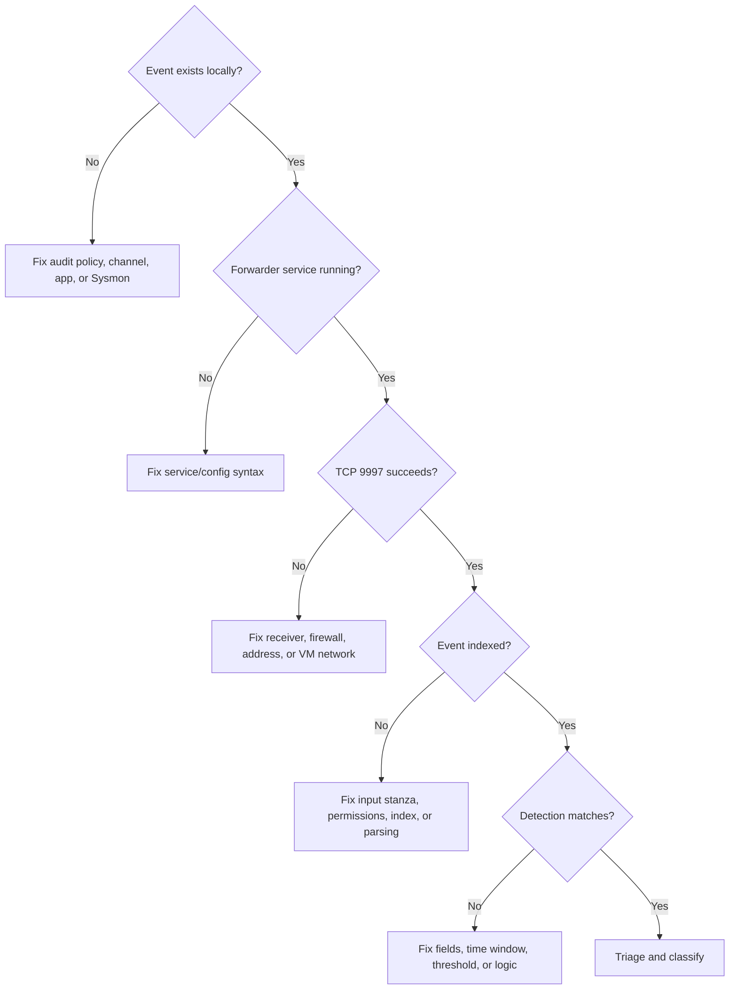

# Troubleshooting Matrix

Troubleshoot from the data source toward the analyst. Change one variable at a
time and record the before/after result.

## Fast layer check



## Network and VMware

| Symptom | Read-only checks | Likely cause | Safe next action |
|---|---|---|---|
| Duplicate/unstable address | `ip -br address`, `Get-NetIPConfiguration` | DHCP still active or duplicate static IP | Power off one VM, correct address plan, disable lab DHCP |
| VM cannot reach same subnet | Adapter status, VMnet selection, host firewall | Wrong virtual switch or disconnected adapter | Correct only the affected VM adapter |
| Unexpected internet access | `ip route show default`, `Get-NetRoute` | NAT/bridged adapter still attached | Disconnect it before tests and document |
| Ping fails but port works | `Test-NetConnection -Port 9997` | ICMP blocked | Use application-layer validation |

## Splunk server

| Symptom | Read-only checks | Likely cause | Safe next action |
|---|---|---|---|
| Splunk Web unavailable | `splunk status`, `ss -lntp` | Service stopped, port changed, firewall | Start service or correct documented port/rule |
| TCP 9997 closed | `ss -lntp \| grep ':9997'` | Receiver not enabled/restarted | Enable one receiver and validate listener |
| Index missing | Settings → Indexes, REST inventory | Index not created or name differs | Create/correct index before forwarding |
| Search time wrong | `timedatectl status` | Time-zone/clock issue | Fix time, then recollect evidence |
| High resource use | Splunk Monitoring Console, host metrics | Broad searches or insufficient VM resources | Narrow time/search; record allocation change |

## Windows telemetry

| Symptom | Read-only checks | Likely cause | Safe next action |
|---|---|---|---|
| Event absent locally | `auditpol /get`, `Get-WinEvent` | Audit subcategory/logging disabled | Enable only required policy and retest |
| PowerShell events absent | GPO result, Operational channel | Script/module logging not applied | `gpupdate /force`, generate known marker |
| Sysmon channel absent | `Get-Service Sysmon*` | Not installed or conflicting implementation | Verify source/install state; do not double-install |
| Sysmon event ID 3 absent | Active Sysmon configuration | NetworkConnect not enabled/filtered | Review XML and expected volume before change |
| Command line missing | Process-creation GPO | Include-command-line policy disabled | Enable in lab; use synthetic data only |

## Universal Forwarder

| Symptom | Read-only checks | Likely cause | Safe next action |
|---|---|---|---|
| Service stopped | `Get-Service SplunkForwarder` | Install/config/service error | Review newest `splunkd.log`; fix first error |
| TCP test fails | `Test-NetConnection` | Receiver/firewall/address/network | Fix path before editing event inputs |
| Connected but no events | `btool inputs list --debug` | Wrong channel, disabled stanza, permission | Correct exact channel/input and restart |
| Events go to wrong index | `btool inputs`, Splunk source search | Index override or typo | Find source file shown by `--debug` |
| Repeated connection errors | `splunkd.log -Tail 100` | Wrong receiver or TLS/auth mismatch | Confirm documented topology and port |

## Splunk data and searches

| Symptom | Check | Likely cause | Safe next action |
|---|---|---|---|
| Data stale | Newest event age by source | Service/network/backlog or idle channel | Generate one known event and remeasure |
| Negative delay | `_indextime-_time` | Clock/time-zone/parsing issue | Align clocks; inspect raw timestamp |
| Fields missing | `fieldsummary`, raw XML | Sourcetype/add-on/rendering difference | Adapt field mapping; document actual fields |
| Search returns nothing | Time picker, index, host, EventCode | Wrong scope/field/casing | Broaden one dimension at a time |
| Search is slow | Time range and base filters | Broad index/time or expensive pipeline | Restrict early; aggregate after filtering |

## Detection tests

| Symptom | Check | Likely cause | Safe next action |
|---|---|---|---|
| Raw event exists but rule misses | Saved SPL/version/time/fields | Field or threshold mismatch | Run rule parts step by step |
| Positive test works once only | Test timing and cleanup | Non-repeatable procedure/state | Reset snapshot; document exact prerequisites |
| Negative test triggers | Intended behavior definition | Threshold/context too broad | Add justified context; rerun all tests |
| Too many alerts | Baseline and grouping keys | Threshold/window/entity selection | Tune from observed ranges, not arbitrary exclusions |
| Alert has no raw link | Alert field/table design | Required identifiers omitted | Include host/time/event record fields |

## Evidence and Git

| Symptom | Check | Likely cause | Safe next action |
|---|---|---|---|
| Image does not render | Exact case-sensitive path | Filename/path mismatch | Rename or correct Markdown link |
| Mermaid not rendered | Fence language and syntax | Missing `mermaid` or syntax error | Validate block on GitHub |
| Secret found before push | `git diff --cached`, grep | Sensitive file/content staged | Unstage exact file, remove secret, rotate if exposed |
| Secret already pushed | Repository history and provider | Credential disclosure | Revoke/rotate immediately; follow GitHub removal guidance |
| Clean clone misses file | Commit/status/path check | File never committed or ignored | Add intended sanitized file and retest clone |

## Troubleshooting record

```text
Issue ID:
UTC time:
Module/test:
Observed symptom:
Expected result:
Last known good state:
Read-only checks performed:
Evidence/log references:
Hypothesis:
One change made:
Result after change:
Root cause:
Rollback required?:
Documentation update:
```

## Escalation rule

Stop the lab session and preserve state when:

- Activity leaves the intended network boundary.
- A real credential or personal dataset is involved.
- The wrong host, account, service, task, or log was changed.
- Evidence needed for analysis may be destroyed.
- The result cannot be explained from recorded facts.
